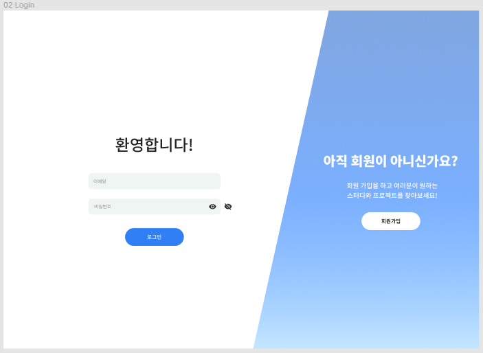
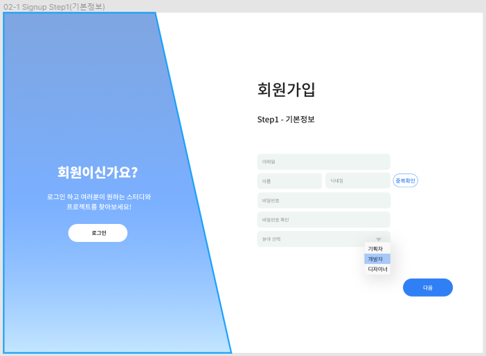
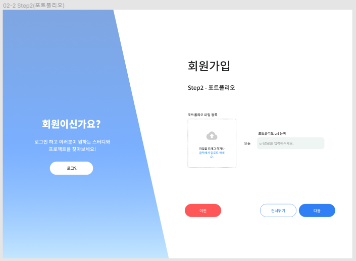
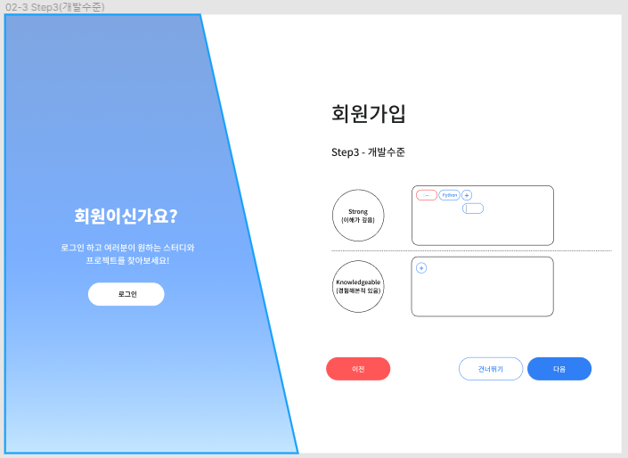
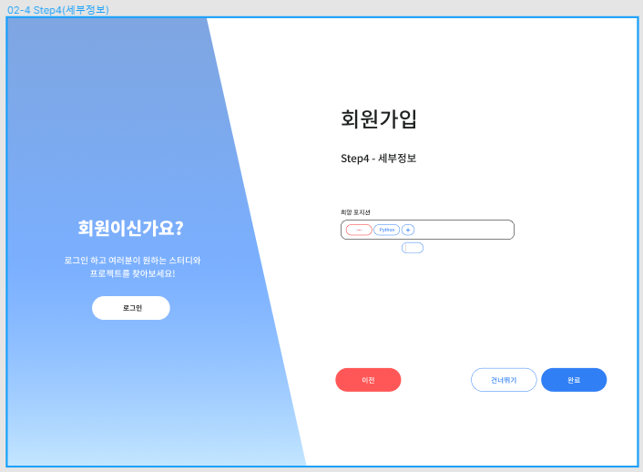

# vue

## Project setup
```
yarn install
```

### Compiles and hot-reloads for development
```
yarn serve
```

### Compiles and minifies for production
```
yarn build
```

### Lints and fixes files
```
yarn lint
```

### Customize configuration
See [Configuration Reference](https://cli.vuejs.org/config/).

1. 메인페이지 화면 구성
   

2. 회원가입/로그인 화면 UI 구성

   2-1. SignIn

   ​	

   2-2 Signup Step1(기본정보)

   ​	

   2-3 Step2(포트폴리오)

   ​	

   2-4 Step3(개발수준)

   ​	

   2-5 Step4(세부정보)

   ​	

3. 스터디 화면 구성
